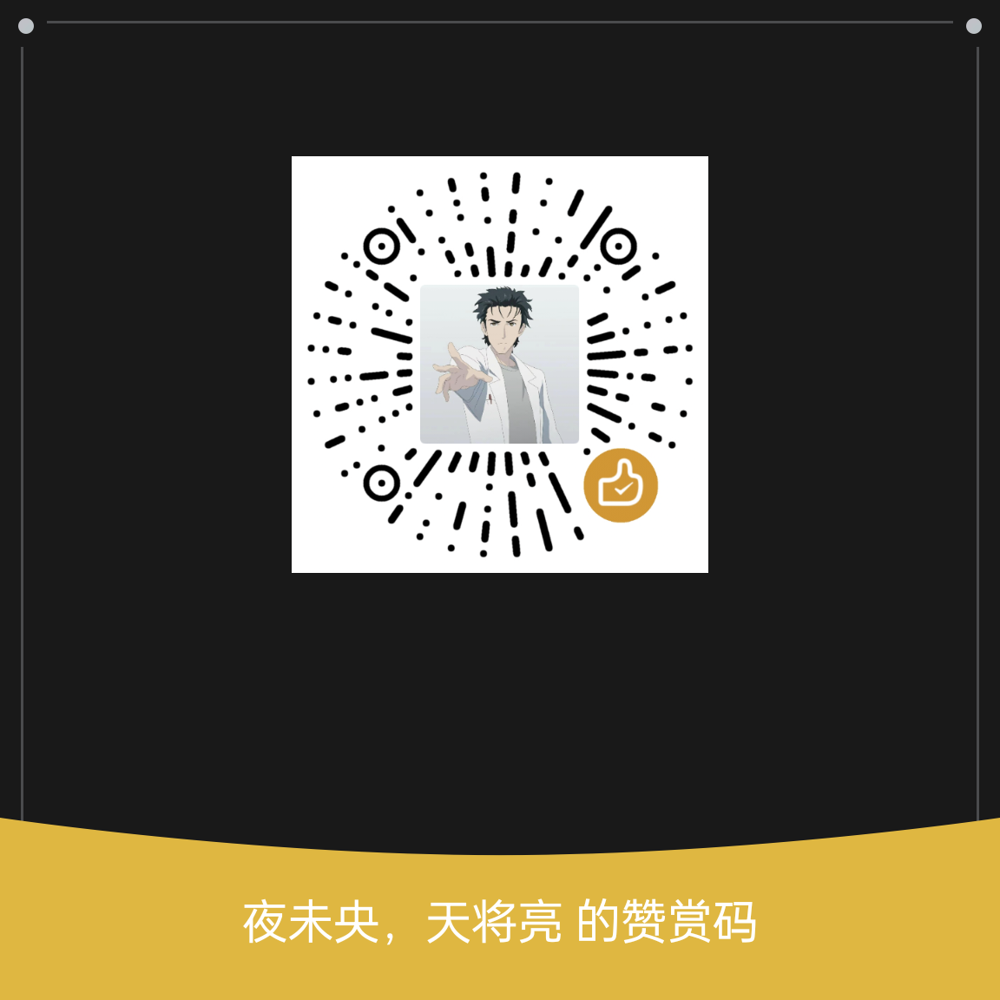

# LANChat

一个跨平台的、无需注册的、支持文件传输的局域网聊天软件。

## 特性

- 🚀 **无需注册** - 自动生成随机用户名，点击用户名即可修改
- 💻 **跨平台支持** - Linux 桌面端、Windows 桌面端、Android App、Web 端
- 🔍 **自动发现** - 基于 UDP 广播/组播的局域网设备自动发现
- 🔗 **手动发现** - 支持 IP 地址、域名、主机名，跨 VLAN / WireGuard 也能互通
- 🔄 **智能回复** - 收到心跳自动回复，只需一方手动添加即可双向发现
- 💬 **实时聊天** - 支持文本消息、流式消息和文件传输
- 📁 **文件传输** - 支持大文件分块传输，可设置自动接收
- 📸 **图片预览** - 图片消息自动预览
- 💾 **历史记录** - SQLite 数据库保存聊天记录
- 🔧 **端口配置** - 可在设置中自定义服务端口，支持 CLI 参数覆盖
- 📂 **数据库路径** - 支持自定义数据库存储位置，配置文件持久化
- 🌐 **Web 端** - 可部署到无图形界面服务器
- 🔔 **系统通知** - Linux 桌面端、Windows 桌面端、Android App、Web 端均支持
- 💡 **托盘图标闪烁** - 点击后跳转最新未读，右键菜单开/关通知
- 🤖 **LANClaw 智能机器人** - 由 Pi 驱动的 AI 聊天机器人，支持自动回复、文件分析和定时任务
- 📱 **Android 双轨文件引擎** — SAF 持久化权限 + Share Intent FD 缓存零拷贝双轨并行
- 🔁 **离线补发** — 离线消息自动缓存，上线后自动补发，支持文件消息

## 技术栈

- **后端**: Rust + Tauri 2.0
- **前端**: 原生 HTML + CSS + JavaScript
- **数据库**: SQLite (sqlx)
- **网络**: UDP 广播/组播 + TCP/WebSocket 传输 + HTTP 分块上传
- **Web 服务器**: Axum
- **AI 机器人**: LANClaw（独立进程，通过 Pi RPC 驱动）

## 快速开始

### aur

```bash
paru -S lanchat-bin
```

### Releases

[https://github.com/cap153/LANChat/releases](https://github.com/cap153/LANChat/releases) 

### 编译

前置要求：

[https://v2.tauri.app/start/prerequisites/](https://v2.tauri.app/start/prerequisites/)   

```bash
# 桌面端
cargo tauri build --bundles deb
cargo tauri build --bundles rpm

# apk
cargo tauri android build --target aarch64
./sign-apk.sh

# windows桌面端
cd src-tauri
cargo xwin build --release --bin lanchat --target x86_64-pc-windows-msvc

# Web 端（精简版，无 GUI 依赖）
cd src-tauri
cargo build --release --bin lanchat-web --features web --no-default-features
cargo build --no-default-features --features web --release --target x86_64-pc-windows-gnu # windows网页端
```

也可以使用 Makefile 一键构建：

```bash
make all          # 构建测试过的所有平台
make deb          # Linux .deb
make rpm          # Linux .rpm
make apk          # Android APK（自动签名）
make windows-desktop  # Windows 桌面端（需要 cargo-xwin）
make web          # Web 端 Linux
make web-windows  # Web 端 Windows
make help         # 查看帮助
```

## 主题

支持自定义`css`，文件名称随意，存储路径：

- **Linux**: `~/.config/lanchat/`
- **Windows**: `%APPDATA%\.config\lanchat`

可以参考内置的主题：[https://github.com/cap153/LANChat/tree/main/src/css](https://github.com/cap153/LANChat/tree/main/src/css) 

## 数据库

### 默认路径
桌面端和 Web 端共享同一个数据库：
- **Linux**: `~/.local/share/com.lanchat.app/lanchat.db`
- **Windows**: `%APPDATA%\com.lanchat.app\lanchat.db`

可在设置面板中修改数据库路径，修改后需重启生效。路径存储在 `~/.config/lanchat/config.json`。

### 数据表
- `settings` - 用户配置（用户名、自动接收、保存路径等）
- `messages` - 聊天记录
- `users` - 局域网发现的用户（计划中）

## 功能状态

### ✅ 已完成

- [x] 自动生成随机用户名
- [x] 点击用户名直接改名
- [x] 局域网设备发现（UDP 广播/组播）
- [x] 实时显示在线用户
- [x] Web 端独立部署
- [x] 桌面端和 Web 端共享数据库
- [x] 设置页面（端口、数据库路径、下载路径）
- [x] 消息历史记录查询
- [x] 主题切换功能
- [x] Android 端适配
- [x] 文本消息传输
- [x] 文件传输功能
- [x] Windows 端适配
- [x] 单实例锁定功能
- [x] 文件流式传输
- [x] 根据系统内存动态调整文件分块大小
- [x] 支持广播和组播
- [x] Android 热点随机网段暴力覆盖
- [x] Web 端文件消息点击直接下载
- [x] 桌面端文件消息点击打开所在路径
- [x] Android 端接收其他应用分享的文件并发送
- [x] Android 端文件消息点击分享到其他应用
- [x] 桌面端、Web 端支持拖拽文件发送
- [x] 桌面端支持粘贴文件发送（零拷贝，Wayland 优先）
- [x] Web 端支持粘贴文件发送
- [x] 图片消息自动预览
- [x] 存在未读消息时红点标注
- [x] 历史消息懒加载（滚动时触发加载历史消息）
- [x] 删除指定聊天记录
- [x] Android 端文件消息点击打开
- [x] 重复文件智能去重（接收端存在文件相同且完整直接引用，文件不同自动重命名）
- [x] 离线用户重新上线消息补发
- [x] 剪切板图片粘贴发送
- [x] 删除离线用户
- [x] 清空聊天记录
- [x] Android 端适配状态栏/三大金刚键
- [x] LANClaw 流式 AI 回复
- [x] 模型切换命令（`/model`）
- [x] 新建会话命令（`/new`）
- [x] 手动发现 IP / 域名 / 主机名（跨 VLAN / WireGuard）
- [x] UDP 心跳自动回复（跨端口/跨网段自动发现）
- [x] 系统通知（桌面: Windows PowerShell / Linux notify-send，Web: Notification API，Android: 原生通知）
- [x] 托盘图标闪烁（未读消息时闪烁提示，点击后跳转最新未读）
- [x] 通知开关（托盘右键菜单，仅桌面端）
- [x] 手动接收文件
- [x] Android SAF 持久化权限 + 零拷贝 FD 缓存双轨机制
- [x] 文件传输速度实时显示

### 🚧 进行中

- [ ] 消息时间加上年月
- [ ] 聊天室功能
- [ ] 更换默认图标

## 运行

1. 启动服务（默认 `8888` 端口，可在设置中修改）：
```bash
lanchat-web --port 8888
```

CLI 参数 `--port` 和 `--db-path` 会覆盖设置中的配置，优先级最高。

2. 配置防火墙示例:
```bash
# TCP：Web 页面和 WebSocket 通信
sudo ufw allow 8888/tcp
# UDP：设备发现（广播/组播/心跳）
sudo ufw allow 8888/udp
```

> **注意**：如果使用非默认端口（如 `--port 9999`），需确保对应端口的 TCP 和 UDP 均已放行。

## 跨 VLAN / WireGuard 场景

当设备处于不同 VLAN 或通过 WireGuard 连接时，UDP 广播无法跨网段。两种解决方案：

### 方案一：手动发现（推荐）

在底部「添加」面板中填写对方的 IP 地址、域名或主机名，系统会定期发送单播心跳完成发现（支持 DNS 解析，60 秒缓存）。

### 方案二：UDP 心跳自动回复

只要一方手动添加了对方地址，收到心跳后会**自动回复**一条心跳，双方都能互相发现。无需两边都设置。

> 心跳回复包含 `|1` 标记，不会产生无限循环。

## 项目结构

```
LANChat/
├── src/                      # 前端代码
│   ├── css/
│   │   ├── style.css        # 样式文件
│   │   └── vscode.css       # VSCode 主题
│   ├── js/
│   │   ├── api.js           # API 封装（Tauri + HTTP 双端）
│   │   ├── app.js           # 应用逻辑
│   │   └── ui.js            # UI 交互
│   └── index.html           # 主页面
├── src-tauri/               # 后端代码（桌面端 + Web 端）
│   ├── src/
│   │   ├── main.rs          # 桌面端 Tauri 入口
│   │   ├── server_main.rs   # Web 端独立入口
│   │   ├── lib.rs           # Android 入口
│   │   ├── commands.rs      # Tauri 桌面命令
│   │   ├── web_server.rs    # HTTP/WebSocket 服务器
│   │   ├── db.rs            # SQLite 数据库逻辑
│   │   ├── config_file.rs   # 配置文件读写（config.json）
│   │   ├── peers.rs         # 在线用户管理器
│   │   ├── models.rs        # 数据模型
│   │   ├── utils.rs         # 工具函数
│   │   └── network/         # 网络模块
│   │       ├── discovery.rs # UDP 设备发现（广播/组播/单播回复）
│   │       └── messaging.rs # WebSocket 消息收发
│   ├── capabilities/        # Tauri 权限配置
│   ├── permissions/         # 自定义命令权限
│   └── Cargo.toml
├── Makefile                 # 一键构建脚本
└── README.md                # 本文件
```

## 文件状态表整理

| 角色       | 状态值                       | 显示文字 |
|------------|------------------------------|----------|
| **发送端** | `status: "pending"`          | 待上线   |
| **发送端** | `file_status: "offering"`    | 待接收   |
| **发送端** | `file_status: "uploading"`   | xx MB/s  |
| **发送端** | `file_status: "sent"`        | 无文字   |
| **接收端** | `file_status: "offered"`     | 未下载   |
| **接收端** | `file_status: "downloading"` | xx MB/s  |
| **接收端** | `file_status: "accepted"`    | 无文字   |

## 疑难解答

**Windows运行软件时提示找不到`VCRUNTIME140_1.dll`、`VCRUNTIME140_1.dll`：**（安装下面的软件）  
[https://aka.ms/vs/17/release/vc_redist.x64.exe](https://aka.ms/vs/17/release/vc_redist.x64.exe)  
[https://aka.ms/vs/17/release/vc_redist.x86.exe](https://aka.ms/vs/17/release/vc_redist.x86.exe)

**Windows运行软件时提示未安装WebView2：**（安装WebView2）  
[https://developer.microsoft.com/zh-cn/microsoft-edge/webview2](https://developer.microsoft.com/zh-cn/microsoft-edge/webview2)

## 许可证

MIT License

## 致谢

- [Tauri](https://tauri.app/) - 跨平台应用框架
- [Axum](https://github.com/tokio-rs/axum) - Web 框架
- [SQLx](https://github.com/launchbadge/sqlx) - 异步 SQL 工具包

## 赞助

如果你觉得这个项目对你有帮助，可以请作者喝杯咖啡 ☕️

<details>
  <summary><b>点击展开赞赏码 (WeChat Pay)</b></summary>
  <br />
  <p align="center">
    
    <br />
  </p>
  <p align="center">感谢您的支持！您的名字将被记录在 <a href="https://github.com/cap153/LANChat/blob/main/.github/SPONSOR.md#-%E6%84%9F%E8%B0%A2%E5%90%8D%E5%8D%95-backers">赞助者名单</a> 中。</p>
</details>
